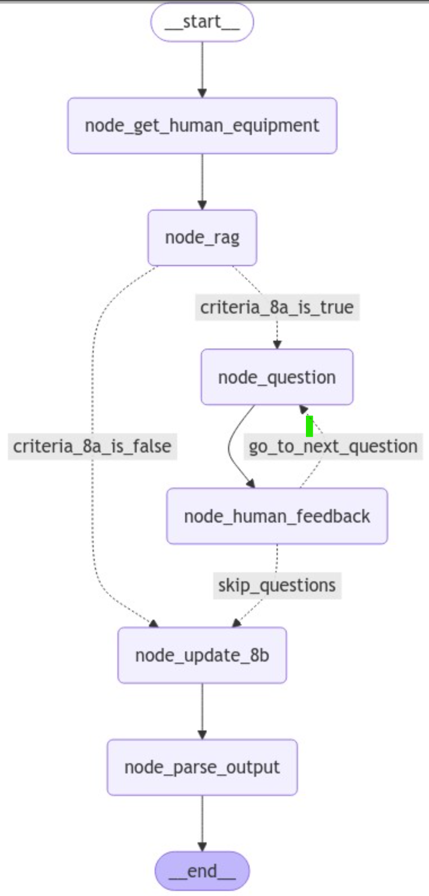

# System impact calssification 

## Introduction:
This GEN ai solution is based in langchain and langgraph to support SME's in manufactiring to get summaries from historical data of equipments. 
The user need to provide initially the equipment and later answer the system questions to get a report (table) with results about historical records.

## Devs info config:
* Intalls requirements (if you want to run notebooks in playground need to "pip instal notebook" manually)
* Create .env file with OpenAI Azure variables as .env_example describes

## Devs info execution: main files are pipeline_etl.py and bot.py that should be executed as follows:
* pipeline_etl.py: If folder "data_processed" is empty, or historical records (excel files) has changed. This script should be executed to updated records.
The Scrip will provide 3 main outputs:
    *  data_processed\merged_historical_records.csv: Merge all the excel files available on data_raw
    *  data_processed\map_equipment_groups.csv: Using data_parser.py generate groups of similar equipments based on merged_historical_records.csv
    *  data_processed\equipment_group_probs.csv: Compute aggregation (mean) on equipment groups (considering 'yes' as 1 and 'no' as 0)
* bot.py: Once "data_processed" folder has the 3 above files you can run it on the terminal. To check the bot paths take a look to the file \playground\bot_flows_experiments_hitl_tree_default.ipynb that describe the graph work flow.

## Front and backend info:
For MVE:
* Backend + Frontend is available in :  frontend_mve.py >> treamlit run frontend_mve.py 

For MPV
* Backend : Based on FAST API, the service.py file provide functionalities to interact with agent using RestAPI: >> uvicorn service:app  
* Frontend: Based on Streamlit, the file client.py encapsulate main options to interact with service trhough the front_end_st.py file >> streamlit run frontend_mvp.py 

## Agent graph:
The system implements to following nodes:
* node_get_human_equipment: get and parse human equipment name
* node_rag: given 'equipment' name and the precomputed criteria probs and group names (from pipeline_etl.py) this node will retrieve the most similar row
* node_question: provide next question based on the answers of previous questions.
* node_human_feedback: get the 'yes/no' answer from user to answer the system questions
* node_update_8b: update the status True/False if historical records of this criteria exceed the threshold (0.5 that means more than 50% of the data)
* node_parse_output: prepare the delivery table, by modiying 8a and 8b criteria with True/False flags.
Note: If want to modify the question three, provide the right configuration on the method get_next_question() by provindg question text and edges

